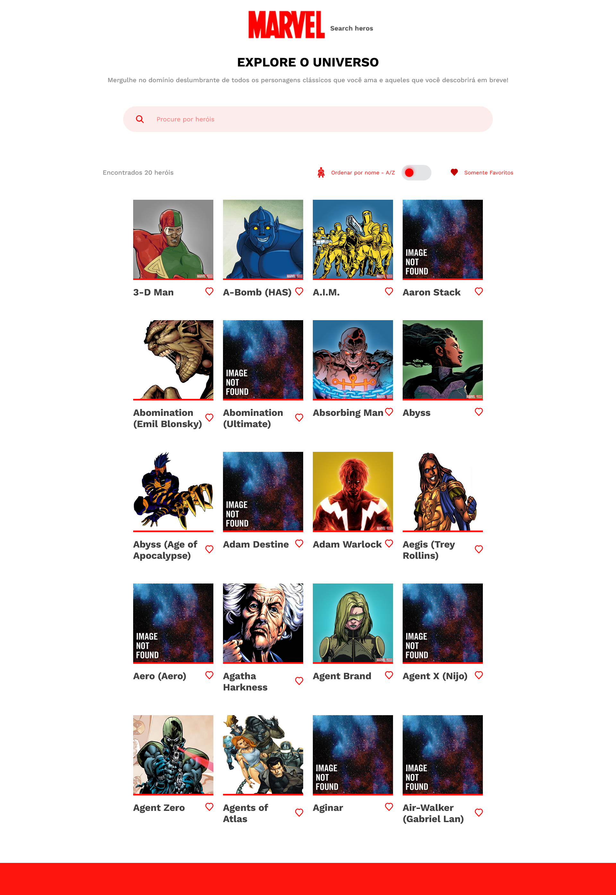

## Frontend Challenge - Marvel Search

### Objetivo
Desenvolver uma aplicação de listagem e detalhe de personagens de quadrinhos.

### Live link
> https://teste-marvel.vercel.app/

### Captura de tela

## Como instalar e acessar localmente

- É preciso ter o Node.JS instalado. Ou acesse o link para download:
> https://nodejs.org/en/download

- Recomendo também o uso do Git:
> https://git-scm.com/downloads

- Crie uma pasta com um nome qualquer onde preferir. Ex: 'Projetos' na área de trabalho.

- Dentro da pasta clique com o botão direito do mouse e escolha a opção:
> 'Git Bash Here'

- Com o terminal aberto faça um clone do projeto digitando:
> git clone https://github.com/willianmassayuki/teste-marvel.git

- Ou faça o downloado o arquivo zip e o descompacte na pasta 'Projetos'

- Dentro da pasta do projeto onde se encontram as pastas 'src', 'public', 'node_modules' 
abra o terminal do git novamente com o botão direito do mouse vá em 'Git Bash Here' e digite o comando:
> npm install vite 

- Para rodar o projeto digite o comando:
> npm run dev

- Aperte Ctrl e clique no endereço local

#### Requisitos funcionais
- Página de listagem de personagens (home):
  - Exibir os 20 primeiros resultados da API;
  - Permitir ordenação por nome do personagem;
  - Permitir filtrar por nome, pelo campo de busca;
  - Permitir mostrar apenas os personagens favoritos;
  - Permitir o usuário favoritar/desfavoritar até 5 personagens;
- Página de detalhe do personagem:
  - Exibir dados do personagem;
  - Exibir últimos 10 quadrinhos lançados deste personagem (onSaleDate);
  - Permitir o usuário favoritar/desfavoritar (dentro do limite de 5).
  
#### `Bônus (não obrigatório)`
- Persistir os dados de favoritos (para manter os dados após o reload da página);
- Layout responsivo;
- Utilização de ES6+;
- Utilização de ferramentas para garantir a qualidade do código;

### Construído com
Vite
React.JS (Hooks useState e useEffect, Template literals, operador ternário, Axios, React Router DOM )
SASS (Mixins, variáveis, nesting, importação de aquivos)

